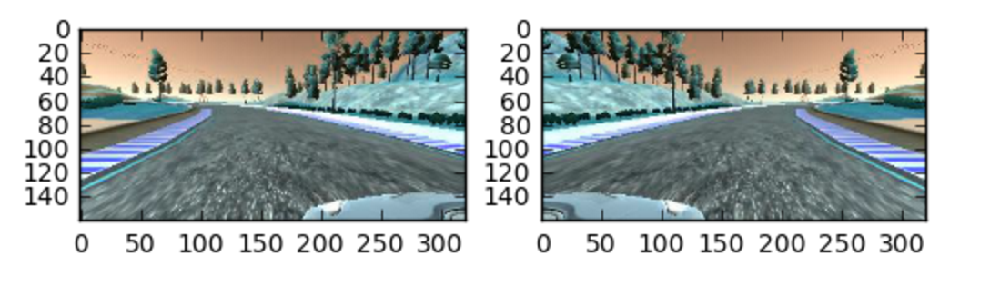

# **Behavioral Cloning**
## Summay
This model drives car well for both track 1 and track 2. In this case the model reaches project basic requirement.

The video created by script `python video.py run1 --fps 48 ` is not enough clear. The best view is from simulator directly and not any fell out of track.  

Another big video1.mp4 and video2.mp4 are also attached for track 1 and track 2 seperatly.

By the way, there are some problems if setting simulator graphics quality to simple or higher in track 2. I think it is because of more details information has been introuduced which are not familar by model.

If you want to run it successfully with high graphics quality, it is necessary to train it with high quality data also.

## Reveiw
### 2017-03-02
After reveiw suggestions from mentors and updated class mateirals, Several solutions have been applied into this model.

* To replace cv2.imread() by mpimg.imread() to make sure right image visulaization.
* To randomly choice center, left and right camera iamges.
* To oversampling input data
* To visualize train_generator histogram
* To flip 50% images to simulate counter-clockwise driving

This model drives car well for both track 1 and 2 even only trainning the model with track 1 data provided by Udacity.

### 2017-02-14
At first, I planned to use keras command `ImageDataGenerator.flow_from_directory(directory)` to read images one by one. This idea is benefit for me to finish this project with my laptop without GPU. However, I found nothing about ImageDataGenerator to deal with steering angles at same time.

Then I take the general method to read csv file first then read images by a generator. This is same to Q&A teacher's method.

However my model doesn't work well from beginning through I tried a lot suggestions from balance data to image augumentation.

I found my balanced data is dummy for the pandas hist() default bins 10.

Through I did a lot of test to study parameter sensitivity and want find solution to improve it, but I did not get qualified model and need mentors suggestion according to my codes.

What I can think to improve is mannual add dummy images for large steering angles, especially nearly bridge.  This is not tested for limited time.

## Key fators:

* cv2.imread(), mpimg.imread() and RGB, BGR
* oversampling and visualize train_generator histogram
* balance input
* crop images
* normalization
* Nvidia 5 convolutional layers and 3 fully connected layers model
* loop train model with updated train data
* randomly use left/right/center images
* flip images 50%

## Reflections
### 2017-03-02
The most important thing is to make sure these images you read it well. It should be paid more attention with RGB and BGR issues.

The sencond important thing is to oversampling and visualize train_generator.

Another important phenomenon is that there are some problems if adjust the simulator graphics qualitiy setting for track 2. The reason is that high graphics quality will introduce more information which the model is not familar.

if we want to run it on high graphics quality successfully, the high graphics quality training data is necessary.

### 2017-02-14
It is very import to visualize data properly to confirm the balance.
The model loss is set mean_squared_error but can not indicate the driving performance directly.
Deep learning magic and charing is to consider probability.
However we can not judge the results directly and have to test it to get feedback. This is conflict with current auto industry status. They ask for anything certain including quality, supply chain.
Data preprocess is very important for deeplearning.

---

**Behavrioal Cloning Project**

The goals / steps of this project are the following:
* Use the simulator to collect data of good driving behavior
* Build, a convolution neural network in Keras that predicts steering angles from images
* Train and validate the model with a training and validation set
* Test that the model successfully drives around track one without leaving the road
* Summarize the results with a written report

## Rubric Points
### Here I will consider the [rubric points](https://review.udacity.com/#!/rubrics/432/view) individually and describe how I addressed each point in my implementation.  

---
### Files Submitted & Code Quality

#### 1. Submission includes all required files and can be used to run the simulator in autonomous mode

My project includes the following files:
* model.py containing the script to create and train the model
* drive.py for driving the car in autonomous mode
* model.h5 containing a trained convolution neural network
* writeup_report_p3.md and writeup_report_p3.pdf summarizing the results
* run1.mp4 for track 1
* run2.mp4 for track 2
* model.ipynb jupyte notebook for this projects

#### 2. Submssion includes functional code
Using the Udacity provided simulator and my drive.py file, the car can be driven autonomously around the track by executing
```
python drive.py model.h5
```

#### 3. Submssion code is usable and readable

The model.py file contains the code for training and saving the convolution neural network. The file shows the pipeline I used for training and validating the model, and it contains comments to explain how the code works.

### Model Architecture and Training Strategy

#### 1. An appropriate model arcthiecture has been employed

The model consists of 5 convolution neural network with 5x5 and 3x3 filter sizes and depths between 24, 36, 48, 64 and 64.

A cropping layer is used first to crop images.

The model includes RELU layers to introduce nonlinearity, and the data is normalized in the model using a Keras lambda layer.

```
# Model architecture
model = Sequential()
# cropping images
model.add(Cropping2D(cropping=((50,20), (0,0)), input_shape=(row,col,ch)))
# normalization 90x320x3
model.add(Lambda(lambda x: (x / 255.0)- 0.5))
model.add(Convolution2D(24, 5, 5, activation='relu', subsample=(2, 2), border_mode='valid', init='he_normal'))
model.add(Convolution2D(36, 5, 5, activation='relu', subsample=(2, 2), border_mode='valid', init='he_normal'))
model.add(Convolution2D(48, 5, 5, activation='relu', subsample=(2, 2), border_mode='valid', init='he_normal'))
model.add(Convolution2D(64, 3, 3, activation='relu', subsample=(1, 1), border_mode='valid', init='he_normal'))
model.add(Convolution2D(64, 3, 3, activation='relu', subsample=(1, 1), border_mode='valid', init='he_normal'))
model.add(Flatten())
model.add(Dense(100, activation='relu', init='he_normal'))
model.add(Dropout(0.5))
model.add(Dense(50, activation='relu', init='he_normal'))
model.add(Dense(10, activation='relu', init='he_normal'))
model.add(Dropout(0.5))
```

#### 2. Attempts to reduce overfitting in the model

The model contains 2 dropout layers in order to reduce overfitting.

The model was trained and validated on different data sets to ensure that the model was not overfitting.

The model was tested by running it through the simulator and ensuring that the vehicle could stay on the track.

#### 3. Model parameter tuning

The model used an adam optimizer, so the learning rate was not tuned manually.

`model.compile(loss='mean_squared_error', optimizer="adam")`

#### 4. Appropriate training data

Training data was chosen to keep the vehicle driving on the road. I used Udacity default data because I tried several times with keyboard to control vehicle and can not get sastified results.

With oversapling and data augmentation, the provided udacity training data can successfully train the model to run and staty on the track.

For details about how I created the training data, see the next section.

### Model Architecture and Training Strategy

#### 1. Solution Design Approach

The overall strategy for deriving a model architecture :

```
# Model architecture
model = Sequential()
# cropping images
model.add(Cropping2D(cropping=((50,20), (0,0)), input_shape=(row,col,ch)))
# normalization 90x320x3
model.add(Lambda(lambda x: (x / 255.0)- 0.5))
model.add(Convolution2D(24, 5, 5, activation='relu', subsample=(2, 2), border_mode='valid', init='he_normal'))
model.add(Convolution2D(36, 5, 5, activation='relu', subsample=(2, 2), border_mode='valid', init='he_normal'))
model.add(Convolution2D(48, 5, 5, activation='relu', subsample=(2, 2), border_mode='valid', init='he_normal'))
model.add(Convolution2D(64, 3, 3, activation='relu', subsample=(1, 1), border_mode='valid', init='he_normal'))
model.add(Convolution2D(64, 3, 3, activation='relu', subsample=(1, 1), border_mode='valid', init='he_normal'))
model.add(Flatten())
model.add(Dense(100, activation='relu', init='he_normal'))
model.add(Dropout(0.5))
model.add(Dense(50, activation='relu', init='he_normal'))
model.add(Dense(10, activation='relu', init='he_normal'))
model.add(Dropout(0.5))
```

This model is from Nvidia end to end model which is well validate.
A dense layer is reduced in order to make it as simple as possible.

The first step was to use cropping to crop images, then use lambda layer to normalization.

The following convolution neural network model similar to the Traffic sign recognition projects and easy to use with keras.

I thought this model might be appropriate and best choice because this model is a very good tool to use, then I can pay more attention to preprocess input data and test with Udacity simulator, especially on input data balancing and oversampling.

In order to gauge how well the model was working, I split my image and steering angle data into a training and validation set. These mean squared error on the training and validation set are similar. This implied that the model was not overfitting.

The final step was to run the simulator to see how well the car was driving around track 1.

At first, there were a few spots where the vehicle fell off the track.

I get a lot of good idea from mentors' review, slack to improve the driving behavior, including crop, normalization, balance and flip.

At the end of the process, the vehicle is able to drive autonomously around the track without leaving the road.

#### 2. Final Model Architecture

The final model architecture consisted of 5 convolution neural network with the following layers.

Here is a visualization of the Nvidia end to end model architecture



#### 3. Creation of the Training Set & Training Process

To capture good driving behavior training data, I tried a lot of times to record vedio but it is hard to get satisfied data.

Finally I decided to use Udaicity data.

At first, the vihicle always go out of track, especially on the bridge, the sharp left turning after the bridge.

Then I strive to improve data balance by oversampling. Detail codes and the raw data histogram show below.







```
# downsampling and oversampling in pandas
# only care for [-0.7, 0.7]
for angleunit in range(0,70,1):
    start_plus = angleunit/100.
    end_plus = start_plus + 1/100.
    # threshold 100
    # this is related to bins and optimized
    thres = 100
    d_range = data[(data.steering < end_plus) & (data.steering >= start_plus)]
    # downsampling if larger than threshold
    if len(d_range) >= thres:
        balanced_data = pd.concat([balanced_data, d_range.sample(thres)])
    elif len(d_range) < 5:
        pass
    else:
        # compare with len(d_range) and thres to oversampling
        aug = thres - d_range.shape[0]
        stp = max((min(aug, d_range.shape[0])// 2), 1)
        loop = aug // stp
        resid = aug % stp
        for i in range(loop):
            balanced_data = pd.concat([balanced_data, d_range.sample(stp)])
        balanced_data = pd.concat([balanced_data, d_range.sample(resid)])  

    start_neg = - angleunit/100.
    end_neg = start_neg - 1/100.
    d_range = data[(data.steering >= end_neg) & (data.steering < start_neg)]
    # downsampling if larger than threshold
    if len(d_range) >= thres:
        balanced_data = pd.concat([balanced_data, d_range.sample(thres)])
    elif len(d_range) < 5:
        pass
    else:
        # compare with len(d_range) and threshold to oversampling
        aug = thres - d_range.shape[0]
        stp = max((min(aug, d_range.shape[0])// 2),1)
        loop = aug // stp
        resid = aug % stp
        for i in range(loop):
            balanced_data = pd.concat([balanced_data, d_range.sample(stp)])
        balanced_data = pd.concat([balanced_data, d_range.sample(resid)])   
```

To augment the data sat, I also flipped images and angles.  For example, here is an image that has then been flipped:



I finally randomly shuffled the data set and put 20% of the data into a validation set.

I used this training data for training the model. The validation set helped determine if the model was over or under fitting.

I set totally epoch 25 to test model.

With keras model.save and load fuction,  I can continous improve model with updated train data set.

I used an adam optimizer so that manually training the learning rate wasn't necessary.
